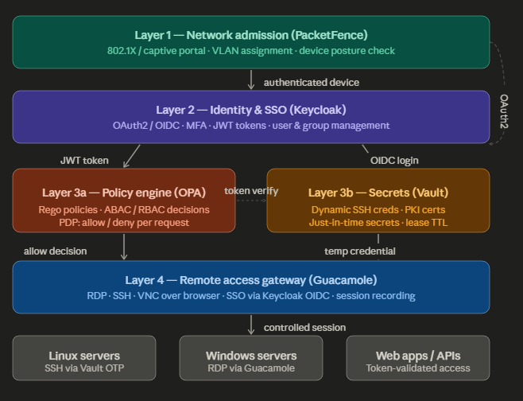

# Zero Trust Network Access Control

A self-hosted, open-source **Zero Trust Network Access Control** system combining PacketFence, Keycloak, OPA, Vault, and Apache Guacamole into a unified access control platform.

---

## Table of contents

- [Architecture overview](#architecture-overview)
- [Repository structure](#repository-structure)
- [Prerequisites](#prerequisites)
- [Quick start](#quick-start)
- [Component configuration](#component-configuration)
  - [Keycloak — Identity provider](#keycloak--identity-provider)
  - [PacketFence — Network admission](#packetfence--network-admission)
  - [Vault — Secrets management](#vault--secrets-management)
  - [OPA — Policy engine](#opa--policy-engine)
  - [Guacamole — Remote access gateway](#guacamole--remote-access-gateway)
- [End-to-end access flow](#end-to-end-access-flow)
- [Database schema](#database-schema)
- [Adding a new user](#adding-a-new-user)
- [Adding a new server](#adding-a-new-server)
- [Revoking access](#revoking-access)
- [Troubleshooting](#troubleshooting)

---

## Architecture overview



**Access decision chain:** Every connection request passes through all four layers. Removing a user from a Keycloak group instantly revokes Vault leases, OPA decisions, and Guacamole sessions.

---

## Repository structure

```
JIADI/
├── guacamole/
│   └── init/
│       ├── 01-guacamole-db.sql      # Schema creation (run first)
│       └── 02-guacamole-db.sql      # Seed data — connections & groups
├── opa/
│   └── policies/
│       └── example.rego             # Base Rego authorization policies
├── docker-compose.yml               # Full stack orchestration
├── server-connect.bat               # Windows helper — open Guacamole session
└── README.md
```

---

## Prerequisites

| Requirement | Version |
|-------------|---------|
| Docker | ≥ 24.x |
| Docker Compose | ≥ 2.x |
| PacketFence | ≥ 14.x (installed via deb, separate host) |
| Open ports | 8080 (Keycloak), 8200 (Vault), 8181 (OPA), 8080 (Guacamole) |

> **Note:** PacketFence runs on a dedicated host with two network interfaces (management + registration). It is not part of the Docker Compose stack.

---

## Quick start

**1. Clone the repository**

```bash
git clone https://github.com/<your-org>/JIADI.git
cd JIADI
```

**2. Copy and edit the environment file**

```bash
cp .env.example .env
# Edit .env with your IP addresses, passwords, and realm name
```

**3. Start the stack**

```bash
docker compose up -d
```

**4. Initialize the Guacamole database**

The `guacamole/init/` SQL files are automatically mounted and executed on first startup. To run them manually:

```bash
docker exec -i jiadi-guacamole-db mysql -u guacamole_user -p guacamole_db \
  < guacamole/init/01-guacamole-db.sql

docker exec -i jiadi-guacamole-db mysql -u guacamole_user -p guacamole_db \
  < guacamole/init/02-guacamole-db.sql
```

**5. Access the services**

| Service | URL | Default credentials |
|---------|-----|---------------------|
| Keycloak admin | `http://<host>:8080/admin` | `admin / admin` ⚠️ change immediately |
| Guacamole | `http://<host>:8080/guacamole` | SSO via Keycloak |
| Vault UI | `http://<host>:8200/ui` | OIDC via Keycloak |
| OPA API | `http://<host>:8181/v1/data` | No auth (internal only) |

---

## Component configuration

### Keycloak — Identity provider

Keycloak is the **single source of truth** for all user identities. Every other component authenticates against it.

#### Create the realm

1. Log in to `http://<host>:8080/admin`
2. Create a new realm named `corp` (do not use `master` for users)
3. Under **Realm Settings → Login**, enable:
   - User registration: OFF
   - Email as username: ON (optional)
   - Login with email: ON

#### Create client registrations

Create one OAuth2/OIDC client per service:

**PacketFence client**

```
Client ID:              packetfence
Client Protocol:        openid-connect
Access Type:            confidential
Valid Redirect URIs:    http://<packetfence-ip>/oauth2/callback
```

**Guacamole client**

```
Client ID:              guacamole
Client Protocol:        openid-connect
Access Type:            public
Valid Redirect URIs:    http://<guacamole-ip>:8080/guacamole/*
Web Origins:            http://<guacamole-ip>:8080
```

**Vault client**

```
Client ID:              vault
Client Protocol:        openid-connect
Access Type:            confidential
Valid Redirect URIs:    http://<vault-ip>:8200/ui/vault/auth/oidc/oidc/callback
                        http://localhost:8250/oidc/callback
```

#### Add a group membership mapper

For each client above, go to **Clients → <client> → Mappers → Create** and add:

```
Name:              groups
Mapper Type:       Group Membership
Token Claim Name:  groups
Full group path:   OFF
Add to access token: ON
Add to ID token:     ON
```

#### Create groups and roles

Go to **Groups** and create:

| Group | Access level |
|-------|-------------|
| `sysadmin` | Full access — all servers, all protocols |
| `devops` | SSH to Linux servers, business hours only |
| `readonly` | Guacamole view sessions only |

#### Enable MFA

1. Go to **Authentication → Flows**
2. Copy the `browser` flow → name it `browser-mfa`
3. Set `OTP Form` to `Required`
4. Go to **Authentication → Bindings** → set Browser Flow to `browser-mfa`

---

### PacketFence — Network admission

PacketFence runs on a **dedicated host** (not in Docker). It intercepts all new device connections and enforces network segmentation via VLANs before any other layer is reached.

#### Initial setup

After deb package installation, run the web configurator:

```
http://<packetfence-ip>:3000/configurator
```

Configure at minimum:
- Management interface (for admin access)
- Registration interface (for captive portal / 802.1X)
- MariaDB credentials
- Admin account

#### Integrate Keycloak as OAuth2 source

1. Go to **Configuration → Policies and Access Control → Authentication Sources**
2. Click **New external source → OAuth2**
3. Fill in:

```
Name:                  keycloak-oauth2
Client ID:             packetfence
Client Secret:         <secret from Keycloak client>
Site:                  http://<keycloak-ip>:8080
Authorize path:        /realms/corp/protocol/openid-connect/auth
Access token path:     /realms/corp/protocol/openid-connect/token
Access token param:    code
API endpoint:          /realms/corp/protocol/openid-connect/userinfo
Scope:                 openid email profile groups
```

4. Add **Authentication Rules**:

| Rule name | Condition | Role | VLAN |
|-----------|-----------|------|------|
| sysadmin-rule | groups contains `sysadmin` | admin | 10 |
| devops-rule | groups contains `devops` | employee | 20 |
| default-rule | catch-all | guest | 99 |

#### Assign to connection profile

1. Go to **Configuration → Policies and Access Control → Connection Profiles**
2. Edit your captive portal profile
3. Under **Sources**, add the `keycloak-oauth2` source

---

### Vault — Secrets management

Vault eliminates static passwords. SSH credentials are generated per-session with a short TTL and automatically expire.

#### Initialize and unseal

```bash
# Initialize (first time only)
docker exec -it jiadi-vault vault operator init \
  -key-shares=3 -key-threshold=2

# Save the unseal keys and root token securely — they will not be shown again

# Unseal (required after every restart)
docker exec -it jiadi-vault vault operator unseal <key-1>
docker exec -it jiadi-vault vault operator unseal <key-2>
```

#### Enable OIDC auth (Keycloak)

```bash
vault auth enable oidc

vault write auth/oidc/config \
  oidc_discovery_url="http://<keycloak-ip>:8080/realms/corp" \
  oidc_client_id="vault" \
  oidc_client_secret="<secret>" \
  default_role="default"

vault write auth/oidc/role/default \
  bound_audiences="vault" \
  allowed_redirect_uris="http://<vault-ip>:8200/ui/vault/auth/oidc/oidc/callback" \
  allowed_redirect_uris="http://localhost:8250/oidc/callback" \
  user_claim="sub" \
  groups_claim="groups" \
  token_policies="default" \
  ttl="1h"
```

#### Enable SSH OTP secrets engine

```bash
vault secrets enable ssh

vault write ssh/roles/otp-role \
  key_type=otp \
  default_user=ubuntu \
  cidr_list=10.0.0.0/8 \
  ttl=300        # 5 minutes — credential expires automatically
```

#### Create access policies

Save the following as `policies/sysadmin.hcl` and `policies/devops.hcl`:

```hcl
# sysadmin.hcl — full SSH access
path "ssh/creds/otp-role" {
  capabilities = ["create", "update"]
}
path "ssh/roles/*" {
  capabilities = ["read", "list"]
}

# devops.hcl — SSH access to dev servers only
path "ssh/creds/otp-role" {
  capabilities = ["create", "update"]
}
```

Load them:

```bash
vault policy write sysadmin policies/sysadmin.hcl
vault policy write devops   policies/devops.hcl
```

#### Install vault-ssh-helper on target servers

Run on **each server** that should accept Vault OTP:

```bash
wget https://releases.hashicorp.com/vault-ssh-helper/<version>/vault-ssh-helper_<version>_linux_amd64.zip
unzip vault-ssh-helper_*.zip -d /usr/local/bin/

cat > /etc/vault-ssh-helper.d/config.hcl <<EOF
vault_addr         = "http://<vault-ip>:8200"
ssh_mount_point    = "ssh"
tls_skip_verify    = false
allowed_roles      = "otp-role"
EOF

# Edit /etc/pam.d/sshd — replace "auth substack password-auth" with:
# auth requisite pam_exec.so quiet expose_authtok log=/var/log/vault-ssh.log \
#   /usr/local/bin/vault-ssh-helper -dev -config=/etc/vault-ssh-helper.d/config.hcl
# auth optional pam_unix.so not_set_pass use_first_pass nodelay

# Edit /etc/ssh/sshd_config:
# ChallengeResponseAuthentication yes
# UsePAM yes
# PasswordAuthentication no

systemctl restart sshd
```

---

### OPA — Policy engine

OPA is the **Policy Decision Point**. It evaluates Rego policies and returns allow/deny to any service that queries it.

#### Policy file: `opa/policies/example.rego`

```rego
package network.authz

import future.keywords.if
import future.keywords.in

default allow = false

# Sysadmins have unrestricted access
allow if {
  "sysadmin" in input.user.groups
}

# Devops can SSH to Linux servers during business hours (UTC+1)
allow if {
  "devops" in input.user.groups
  input.resource.protocol == "ssh"
  input.resource.os == "linux"
  business_hours
}

# Devops can RDP to Windows servers during business hours
allow if {
  "devops" in input.user.groups
  input.resource.protocol == "rdp"
  business_hours
}

# Business hours: Monday–Friday, 08:00–18:00
business_hours if {
  now := time.now_ns()
  day := time.weekday(now)
  day != "Saturday"
  day != "Sunday"
  hour := time.clock(now)[0]
  hour >= 8
  hour < 18
}
```

#### Test a policy decision

```bash
curl -s -X POST http://<opa-ip>:8181/v1/data/network/authz/allow \
  -H "Content-Type: application/json" \
  -d '{
    "input": {
      "user": { "groups": ["devops"] },
      "resource": { "protocol": "ssh", "os": "linux", "host": "10.0.1.5" }
    }
  }'

# Expected: {"result": true}
```

#### Reload policies without restart

```bash
curl -s -X PUT http://<opa-ip>:8181/v1/policies/network \
  -H "Content-Type: text/plain" \
  --data-binary @opa/policies/example.rego
```

---

### Guacamole — Remote access gateway

Guacamole provides browser-based RDP, SSH, and VNC access. All authentication is delegated to Keycloak via OIDC.

#### OIDC configuration

Add to `/etc/guacamole/guacamole.properties` (or mount via Docker volume):

```properties
# Keycloak OIDC
openid-authorization-endpoint: http://<keycloak-ip>:8080/realms/corp/protocol/openid-connect/auth
openid-jwks-endpoint:           http://<keycloak-ip>:8080/realms/corp/protocol/openid-connect/certs
openid-issuer:                  http://<keycloak-ip>:8080/realms/corp
openid-client-id:               guacamole
openid-redirect-uri:            http://<guacamole-ip>:8080/guacamole
openid-username-claim-type:     preferred_username
openid-groups-claim-type:       groups
openid-scope:                   openid email profile groups
```

Install the OIDC extension:

```bash
# Download from https://guacamole.apache.org/releases/
tar -xzf guacamole-auth-sso-<version>.tar.gz
cp guacamole-auth-sso-openid/guacamole-auth-sso-openid-<version>.jar \
   /etc/guacamole/extensions/
# Restart Guacamole
docker compose restart guacamole
```

#### Adding a connection (SSH example)

In Guacamole admin (`/guacamole/#/settings/connections`):

```
Name:          prod-linux-01
Protocol:      SSH
Hostname:      10.0.1.5
Port:          22
Username:      ubuntu
Password:      (leave empty — Vault OTP will be injected)
```

Assign the connection to the `sysadmin` or `devops` group in Guacamole, matching your Keycloak groups.

#### `server-connect.bat` — Windows quick-connect helper

This script opens the Guacamole web interface in the default browser for Windows users:

```bat
@echo off
REM JIADI — Open Guacamole remote access portal
set GUACAMOLE_URL=http://<guacamole-ip>:8080/guacamole
echo Opening JIADI Access Portal...
start "" "%GUACAMOLE_URL%"
```

---

## End-to-end access flow

```
1. Device connects to network
        └─► PacketFence intercepts → redirects to captive portal
        └─► User logs in via Keycloak (MFA enforced)
        └─► Keycloak returns JWT with group claims
        └─► PacketFence reads groups → assigns VLAN

2. User opens Guacamole in browser
        └─► Guacamole redirects to Keycloak SSO
        └─► Keycloak issues ID token with groups claim
        └─► Guacamole reads groups → shows allowed connections only

3. User clicks a connection (e.g. SSH to prod-linux-01)
        └─► Guacamole (or proxy) calls OPA:
            POST /v1/data/network/authz/allow
            { user.groups: ["devops"], resource.protocol: "ssh" }
        └─► OPA evaluates example.rego → returns true/false
        └─► If true: Guacamole calls Vault:
            POST /v1/ssh/creds/otp-role { ip: "10.0.1.5" }
        └─► Vault issues a one-time password (TTL: 5 min)
        └─► Guacamole uses OTP to open SSH session

4. Session ends
        └─► OTP expired automatically by Vault
        └─► Session recorded by Guacamole (if recording enabled)
```

---

## Database schema

Two SQL files initialize the Guacamole database:

**`01-guacamole-db.sql`** — Creates the schema (tables: `guacamole_user`, `guacamole_connection`, `guacamole_connection_group`, `guacamole_connection_permission`, etc.)

**`02-guacamole-db.sql`** — Seeds initial data:
- Connection groups mapped to Keycloak groups (`sysadmin`, `devops`, `readonly`)
- Pre-defined server connections (RDP/SSH/VNC)
- Permission assignments

To inspect the current connections:

```sql
SELECT c.connection_name, c.protocol, c.proxy_hostname
FROM guacamole_connection c
ORDER BY c.connection_name;
```

---

## Adding a new user

1. **Create user in Keycloak** — Admin → Users → Add user
2. **Assign to a group** — Users → `<user>` → Groups → Join `sysadmin` / `devops` / `readonly`
3. **Set temporary password** — Users → `<user>` → Credentials → Set password → Temporary: ON
4. **User sets up MFA** — On first login, user is prompted to enroll OTP

No changes required in Guacamole, OPA, or Vault — they all read from Keycloak JWT claims automatically.

---

## Adding a new server

1. **Configure `vault-ssh-helper`** on the new server (see [Vault section](#vault--secrets-management))

2. **Add connection in Guacamole**:
   - Admin → Connections → New Connection
   - Fill hostname, protocol, port
   - Assign to the appropriate connection group

3. **Update OPA policy** if the new server requires special access rules:
   ```rego
   # In opa/policies/example.rego
   allow if {
     "devops" in input.user.groups
     input.resource.host == "10.0.2.10"   # new server IP
     input.resource.protocol == "ssh"
   }
   ```
   Then reload the policy (see [OPA section](#opa--policy-engine)).

---

## Revoking access

| Scenario | Action |
|----------|--------|
| User leaves the company | Delete or disable user in Keycloak → all downstream access revoked immediately |
| Remove access to one server | Remove user from group in Keycloak, or update OPA policy |
| Emergency lockout | Disable user in Keycloak + run `vault lease revoke -prefix auth/oidc/` |
| Revoke all active Vault leases | `vault lease revoke -prefix ssh/creds/otp-role` |

---

## Troubleshooting

**PacketFence captive portal not redirecting to Keycloak**
- Verify the OAuth2 source is assigned to the active connection profile
- Check `http://<keycloak>:8080/realms/corp/.well-known/openid-configuration` is reachable from PacketFence

**Guacamole login loop / redirect error**
- Confirm `openid-redirect-uri` in `guacamole.properties` exactly matches the Redirect URI registered in the Keycloak client
- Check Guacamole logs: `docker logs jiadi-guacamole`

**Vault returns 403 on SSH creds**
- Confirm the user's Keycloak group is mapped to the correct Vault policy
- Verify OIDC role has `groups_claim = "groups"` and the JWT actually contains the group

**OPA returns deny unexpectedly**
- Test directly with `curl` (see [OPA section](#opa--policy-engine))
- Check if business hours constraint is blocking the request
- Enable OPA decision logs: add `--log-level=debug` to the OPA container command

**Vault sealed after restart**
```bash
docker exec -it jiadi-vault vault operator unseal <key-1>
docker exec -it jiadi-vault vault operator unseal <key-2>
```

---

## License

MIT — see `LICENSE` for details.